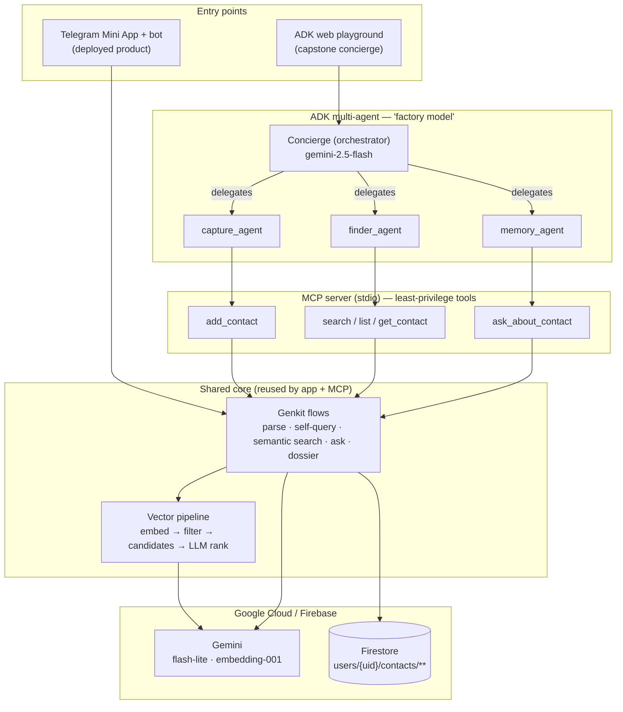

# Just Contacts — a second memory for the people you meet

> **Capstone submission — Google × Kaggle "AI Agents: Intensive Vibe Coding".**
> Track: **Concierge Agents.**

Just Contacts is an AI personal-CRM that turns one messy sentence about a person into a
clean, structured, searchable profile — and then lets you find people the way you actually
remember them ("the designer I had lunch with"), not by exact name. It ships as a deployed
**Telegram Mini App + bot**, and for this capstone it is extended with a portable **agent
layer**: a **Model Context Protocol server** and a **Google ADK multi-agent** that drive the
same intelligence through a conversational concierge.

**Concepts demonstrated:** ADK multi-agent · MCP server · Antigravity · Security · Deployability · Agent skills
**Stack:** Next.js 15 · Genkit + Gemini · Firebase · Google ADK · Model Context Protocol

| Resource | Link |
|----------|------|
| 🤖 Live product (Telegram) | <!-- TODO: bot link --> |
| 🎬 Demo video (≤5 min) | <!-- TODO: YouTube link --> |
| 📝 Kaggle write-up | <!-- TODO: Kaggle link --> |

---

## 1. What it does

You describe a person in plain language — for example:

> *"Ivan from the AI conference, snowboards, works at Yandex as a backend dev, +7 999 123 45 67"*

…and Just Contacts extracts the **name**, **role/company**, **tags**, **phone**, **email**, and a
short **dossier** of who this person is, then saves a ready-made profile. No forms. You can also
attach a photo of a business card or forward a contact from your phone book.

Once people are saved, the app helps you keep them:

- **Find by meaning.** Search like you remember: *"who works in design?"*, *"who fixes cars"*,
  *"the person I met at the hackathon"*. A hybrid semantic + keyword pipeline returns the right
  people even when you don't recall the name.
- **A living dossier.** Each contact has an AI dossier — a short "who is this" summary plus key
  facts. After you log a meeting or a call, the dossier updates itself from that history.
- **Ask about a person.** On a contact's card you can ask *"where did we meet?"* or *"what did I
  promise to send them?"* — answered strictly from that contact's saved dossier and history.
- **Log interactions.** Add meetings, calls and notes; they become a timeline the dossier draws on.
- **Never forget.** Birthday reminders and a "reconnect" nudge for people you haven't spoken to in
  a while; mark favorites; export everything as vCard.

The point is to remove the effort. People will *say* a sentence about someone, but they won't fill
in eight form fields — so the AI does the structuring, and the human just talks.

## 2. The problem

We meet people constantly — conferences, events, work, online — and then we lose them. A normal
phone contact stores a *number*; it remembers nothing about the *person*: where you met, what they
do, what you owe them. Business cards die in a drawer; names fade in a week; warm leads go cold.

The information isn't hard to capture — it's just trapped behind data entry nobody wants to do.
That's the gap Just Contacts closes.

## 3. Why agents (and not just an app)

The core task is genuinely agentic — it requires perceiving intent, choosing tools, acting, and
checking the result, not a single prompt:

- **Capture** needs structured extraction with strict rules (don't invent facts, dedupe by phone,
  keep the dossier to durable traits — not one-off plans).
- **Recall** needs a *pipeline*, not one call: separate hard filters from meaning, embed, pre-rank
  by vectors, then have a model make the final relevance judgement.
- **Conversation** needs delegation: a router that decides whether the user wants to *save*, *find*,
  or *ask about* someone, and hands off to a specialist.

The ADK orchestrator + MCP tools express exactly this: an agent that reasons about the goal and
calls the right capability, instead of one model trying to do everything at once.

---

## 4. Architecture

Two surfaces — the deployed Telegram product and the capstone ADK concierge — drive **one shared
core** (the Genkit flows + vector pipeline). The MCP server doesn't reimplement anything; it makes
the existing, production-tested core callable by any agent runtime.



### The agent layer (the capstone contribution)

**MCP server** (`mcp-server/`) — a [Model Context Protocol](https://modelcontextprotocol.io) server,
over stdio, exposing five tools: `add_contact`, `search_contacts`, `list_contacts`, `get_contact`,
`ask_about_contact`. Each is a thin wrapper over the **same** Genkit flows and vector search the
product uses, so a contact created by an agent is identical to one a person creates in the app.

**ADK multi-agent** (`adk-agent/`) — a Google ADK system in the whitepaper's *factory model*: a
**Concierge orchestrator** (`gemini-2.5-flash`) that delegates to three specialists
(`gemini-2.5-flash-lite`), each with a narrow, least-privilege slice of the toolset:

| Specialist | MCP tools | Job |
|------------|-----------|-----|
| `capture_agent` | `add_contact` | Save a new person from free text |
| `finder_agent` | `search_contacts`, `list_contacts`, `get_contact` | Find / browse / open existing people |
| `memory_agent` | `get_contact`, `ask_about_contact` | Answer grounded questions about one person |

This deliberately applies two course ideas: **tool access via MCP** (vendor-agnostic — the same
server works for ADK, Claude, or the Gemini CLI), and **intelligent model routing** (a stronger
model for routing judgement, a cheaper one for the specialists).

### How search actually works

`search_contacts` reproduces the production pipeline, not a naive vector lookup:

1. **Self-query** — split the query into a semantic part + hard logical filters (exclusions like
   "except colleagues", a birthday month) that embeddings can't express.
2. **Embed** the query with `gemini-embedding-001` (256-dim, task-typed for retrieval).
3. **Candidate set** = adaptive top-k by cosine similarity over per-fact **int8 multi-vectors**
   (each dossier fact gets its own vector, so a pointed detail isn't averaged away) **∪** keyword
   matches the embedding might miss.
4. **LLM relevance** ranks only that small candidate set — so token cost stays flat no matter how
   many contacts a user has.

---

## 5. Course concepts → where to find them

| Concept | Evidence in this repo |
|---------|-----------------------|
| **Agent / multi-agent (ADK)** | `adk-agent/contacts_concierge/agent.py` — orchestrator + 3 delegated specialists |
| **MCP server** | `mcp-server/server.ts`, `mcp-server/contacts-store.ts` — 5 tools over stdio |
| **Antigravity** | Built and iterated in the Antigravity IDE (shown in the video) |
| **Security features** | `firestore.rules` (path ownership), `src/lib/server-auth.ts`, `src/lib/rate-limit.ts`, MCP single-user scope + input guardrails |
| **Deployability** | `apphosting.yaml` (Firebase App Hosting), `vercel.json` (Vercel); ADK deployable to Agent Engine |
| **Agent skills** | `.agents/skills/` + `skills-lock.json` (Firebase agent-skills) |

---

## 6. Security

Security is enforced in code, not by hope:

- **Path-based ownership** — `firestore.rules` lets a user touch only `users/{their-uid}/**`;
  ownership fields are immutable after create; `bot_state` / `rate_limits` are server-only.
- **Authenticated entry points** — `requireAuth` (Firebase ID-token verification) wraps every
  client-facing AI flow; the bot webhook verifies a shared secret echoed by Telegram.
- **Rate limiting** — per-user, Firestore-backed (survives serverless cold starts).
- **MCP least privilege** — the server is hard-scoped to a single `MCP_USER_ID`; tool handlers
  never accept a user id from the model, and each ADK specialist sees only the tools it needs.
- **Input guardrails** — length caps + empty-input rejection run before any tool logic.
- **No secrets in code** — all keys come from environment variables; `.env` is git-ignored and
  only `.env.example` is committed.

---

## 7. Repository layout

```
just-contacts-capstone/
├── adk-agent/                    # Google ADK multi-agent (capstone)
│   └── contacts_concierge/
│       └── agent.py              # orchestrator + capture/finder/memory specialists
├── mcp-server/                   # Model Context Protocol server (capstone)
│   ├── server.ts                 # tool catalogue + input guardrails (stdio)
│   ├── contacts-store.ts         # data + AI layer, single-user scoped
│   └── smoke-test.ts             # protocol smoke test (no Gemini/Firestore needed)
├── src/
│   ├── ai/
│   │   ├── logic/                # pure AI cores (importable by app, bot, MCP)
│   │   ├── flows/                # 'use server' wrappers (auth + rate limit)
│   │   └── genkit.ts             # Gemini model config
│   ├── lib/vector.ts             # I/O-free vector + candidate-selection math
│   ├── app/                      # Next.js app + Telegram bot webhook
│   └── firebase/                 # client SDK wiring (config from env)
├── firestore.rules               # security model
├── AGENTS.md                     # context-engineering rules for coding agents
└── README.md
```

---

## 8. Setup & run

> Judges are **not** required to run this — the video and the live product are the demo. These
> steps are for full reproducibility with your own credentials.

### Prerequisites
- **Node.js ≥ 20** and **Python ≥ 3.10**
- A **Gemini API key** ([aistudio.google.com/apikey](https://aistudio.google.com/apikey))
- A **Firebase project** with Firestore + a service-account key

### 1) Install
```bash
npm install                                   # app + MCP server
cd adk-agent && python -m venv .venv
.venv\Scripts\activate                        # macOS/Linux: source .venv/bin/activate
pip install -r requirements.txt && cd ..
```

### 2) Configure
Copy `.env.example` → `.env` and fill it in (see `.env.example` for every key).

### 3) Run
```bash
npm run mcp:smoke        # verify the MCP server + tool schemas (no API calls)
npm run dev              # the web/Telegram app on http://localhost:9002
cd adk-agent && adk web  # the ADK concierge playground
```
Then in the playground, pick `contacts_concierge` and try:
> "Save Ivan from the AI conf, snowboards, works at Yandex, +7 999 123 45 67"
> "who works in design?" · "where did I meet Ivan?"

> The agents spawn the MCP server via `npx tsx mcp-server/server.ts`, so `npm install` must have
> run in the repo root first.

---

## 9. Tech stack

- **App** — Next.js 15 (App Router, RSC), TypeScript, Tailwind, Radix UI; Telegram Mini App.
- **AI** — Genkit + Gemini (`gemini-2.5-flash-lite` for reasoning, `gemini-embedding-001` truncated
  to 256-dim int8 multi-vectors for retrieval).
- **Agents** — Google ADK (multi-agent + `McpToolset`), Model Context Protocol (TypeScript SDK).
- **Backend** — Firebase: Firestore, Auth (Telegram custom tokens), App Hosting.
- **Built with** — the Antigravity agent-first IDE; Firebase agent-skills via `skills-lock.json`.

---

## 10. License
**Proprietary — All Rights Reserved.** The code is public for review/evaluation only; no rights to
use, copy, modify, or distribute are granted. See `LICENSE`.
