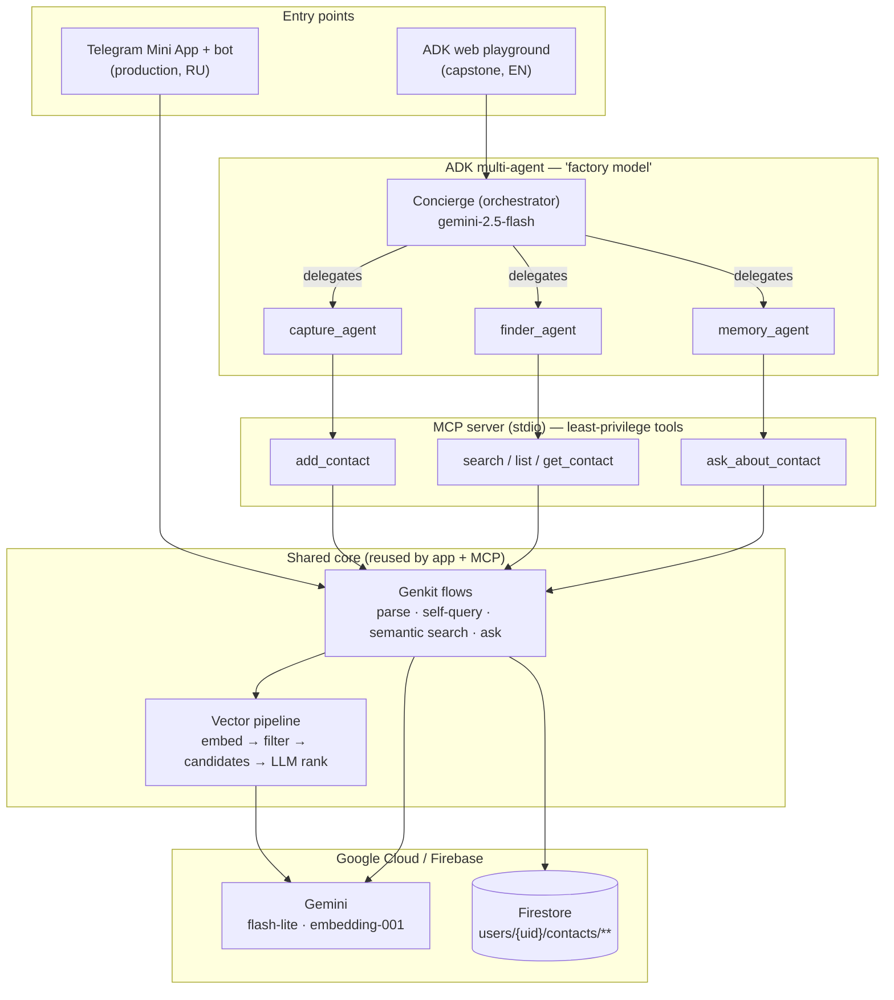

# Just Contacts — a second memory for the people you meet

> **Capstone submission — Google × Kaggle "AI Agents: Intensive Vibe Coding".**
> Track: **Concierge Agents.**
> A personal-CRM agent that turns one plain sentence about a person into a clean,
> searchable profile — and lets you find people by *meaning*, not by exact name.

<!-- Badges are plain text on purpose: no external services, nothing to leak. -->
**Concepts demonstrated:** ADK multi-agent · MCP server · Antigravity · Security · Deployability · Agent skills
**Stack:** Next.js 15 · Genkit + Gemini · Firebase · Google ADK · Model Context Protocol

| Resource | Link |
|----------|------|
| 🤖 Live product (Telegram) | <!-- TODO: @YourBot link --> |
| 🎬 Demo video (≤5 min) | <!-- TODO: YouTube link --> |
| 📝 Kaggle write-up | <!-- TODO: Kaggle link --> |

---

## 1. The problem

We meet a lot of people — at conferences, online, at work — and then we forget them.
A normal phone contact stores a *number*; it remembers nothing about the *person*: where
you met, what they do, what you promised to send them. The information dies in a form
nobody wants to fill in. The result: weak networks and lost relationships.

The friction is the data-entry. People will happily *say* "Ivan from the AI conf, snowboards,
works at Yandex, +7 999…", but they will not fill in eight form fields for it.

## 2. The solution

**Just Contacts** removes that friction with agents:

- **Capture** — write or say one messy sentence (or forward a contact card). An LLM extracts
  the name, role, tags, phone, email and a short *dossier*.
- **Recall** — search by meaning ("the designer I had lunch with", "who fixes cars") using a
  hybrid semantic + keyword pipeline, then ask grounded questions about a specific person.
- **Stay in touch** — reminders for birthdays and people you haven't spoken to in a while.

It ships today as a **Telegram Mini App + bot** (a real, deployed product). For this capstone
it is extended with a **portable agent layer** — an **MCP server** and a **Google ADK
multi-agent** — so the same intelligence can be driven by any agent runtime and shown to
judges through an English, conversational playground.

### Why agents (not just an app)?
The core task *is* agentic: perceive a goal ("remember this person" / "find who I mean"),
choose tools, act, observe, and answer. A single LLM call cannot do it reliably — it needs
structured extraction, a retrieval pipeline, and delegation between specialists. That is
exactly what the ADK orchestrator + MCP tools provide.

---

## 3. Architecture

Two entry points (the production Telegram app and the capstone ADK agent) drive **one shared
core** — the Genkit flows and vector pipeline — over different surfaces. Nothing intelligent is
duplicated; the MCP server simply makes the existing core callable by any agent.



### The agent layer (the capstone contribution)

**MCP server** (`mcp-server/`) — a [Model Context Protocol](https://modelcontextprotocol.io)
server over stdio that exposes five tools (`add_contact`, `search_contacts`, `list_contacts`,
`get_contact`, `ask_about_contact`). Each tool is a thin wrapper over the **same** Genkit flows
and vector search the production app uses, so a contact added by an agent is identical to one
added by a human in the app.

**ADK multi-agent** (`adk-agent/`) — a Google ADK system following the whitepaper's *factory
model*: a **Concierge orchestrator** (`gemini-2.5-flash`) that delegates to three specialists
(`gemini-2.5-flash-lite`), each holding a narrow, least-privilege slice of the MCP toolset:

| Specialist | MCP tools | Job |
|------------|-----------|-----|
| `capture_agent` | `add_contact` | Save a new person from free text |
| `finder_agent` | `search_contacts`, `list_contacts`, `get_contact` | Find / browse / open existing people |
| `memory_agent` | `get_contact`, `ask_about_contact` | Answer grounded questions about one person |

This applies two course concepts deliberately: **tool access via MCP** (vendor-agnostic), and
**intelligent model routing** (a stronger model for routing judgement, a cheaper one for the
specialists).

### How search actually works
`search_contacts` reproduces the production pipeline, not a naive vector lookup:

1. **Self-query** — split the query into a semantic part + hard logical filters (exclusions,
   birthday month) that embeddings can't express.
2. **Embed** the query (`gemini-embedding-001`, 256-dim, task-typed).
3. **Candidate set** = adaptive top-k by cosine similarity over per-fact int8 multi-vectors
   **∪** keyword matches the embedding might miss.
4. **LLM relevance** ranks only that small candidate set — so token cost stays flat no matter
   how many contacts the user has.

---

## 4. Course concepts → where to find them

| Concept | Evidence in this repo |
|---------|-----------------------|
| **Agent / multi-agent (ADK)** | `adk-agent/contacts_concierge/agent.py` — orchestrator + 3 delegated specialists |
| **MCP server** | `mcp-server/server.ts`, `mcp-server/contacts-store.ts` — 5 tools over stdio |
| **Antigravity** | Built and iterated in the Antigravity IDE (shown in the video) |
| **Security features** | `firestore.rules` (path ownership), `src/lib/server-auth.ts`, `src/lib/rate-limit.ts`, MCP single-user scope + input guardrails |
| **Deployability** | `apphosting.yaml` (Firebase App Hosting), `vercel.json` (Vercel); ADK deployable to Agent Engine |
| **Agent skills** | `.agents/skills/` + `skills-lock.json` (Firebase agent-skills) |

---

## 5. Security

Security is enforced in code, not by hope:

- **Path-based ownership** — `firestore.rules` lets a user touch only `users/{their-uid}/**`;
  ownership fields are immutable after create; `bot_state` / `rate_limits` are server-only.
- **Authenticated entry points** — `requireAuth` (Firebase ID-token verification) wraps every
  client-facing AI flow; the bot webhook verifies a shared secret echoed by Telegram.
- **Rate limiting** — per-user, Firestore-backed (survives serverless cold starts).
- **MCP least privilege** — the server is hard-scoped to a single `MCP_USER_ID`; tool handlers
  never accept a user id from the model, and each ADK specialist sees only the tools it needs.
- **Input guardrails** — length caps + empty-input rejection run before any tool logic.
- **No secrets in code** — all keys come from environment variables; `.env` is git-ignored and
  only `.env.example` is committed.

---

## 6. Repository layout

```
just-contacts-capstone/
├── adk-agent/                    # Google ADK multi-agent (capstone)
│   └── contacts_concierge/
│       └── agent.py              # orchestrator + capture/finder/memory specialists
├── mcp-server/                   # Model Context Protocol server (capstone)
│   ├── server.ts                 # tool catalogue + input guardrails (stdio)
│   ├── contacts-store.ts         # data + AI layer, single-user scoped
│   └── smoke-test.ts             # protocol smoke test (no Gemini/Firestore needed)
├── src/
│   ├── ai/
│   │   ├── logic/                # pure AI cores (importable by app, bot, MCP)
│   │   ├── flows/                # 'use server' wrappers (auth + rate limit)
│   │   └── genkit.ts             # Gemini model config
│   ├── lib/vector.ts             # I/O-free vector + candidate-selection math
│   ├── app/                      # Next.js app + Telegram bot webhook
│   └── firebase/                 # client SDK wiring (config from env)
├── firestore.rules               # security model
├── AGENTS.md                     # context-engineering rules for coding agents
└── README.md
```

---

## 7. Setup & run

> Judges are **not** required to run this — the video and the live Telegram product are the
> demo. These steps are for full reproducibility with your own credentials.

### Prerequisites
- **Node.js ≥ 20** and **Python ≥ 3.10**
- A **Gemini API key** ([aistudio.google.com/apikey](https://aistudio.google.com/apikey))
- A **Firebase project** with Firestore + a service-account key

### 1) Install
```bash
npm install                                   # app + MCP server
cd adk-agent && python -m venv .venv
.venv\Scripts\activate                        # macOS/Linux: source .venv/bin/activate
pip install -r requirements.txt && cd ..
```

### 2) Configure
Copy `.env.example` → `.env` and fill in:
```ini
GEMINI_API_KEY=...                  # MCP server: parse / search / embed
GOOGLE_API_KEY=...                  # ADK agent's Gemini calls (same key is fine)
GOOGLE_GENAI_USE_VERTEXAI=FALSE
FIREBASE_SERVICE_ACCOUNT_KEY={...}  # single-line JSON, for Firestore access
MCP_USER_ID=tg_123456789            # the ONE user the agent may read/write
NEXT_PUBLIC_FIREBASE_...=...         # Firebase web config (see .env.example)
```

### 3) Run
```bash
npm run mcp:smoke        # verify the MCP server + tool schemas (no API calls)
npm run dev              # the web/Telegram app on http://localhost:9002
cd adk-agent && adk web  # the ADK playground — chat with the Concierge
```
Then in the playground, pick `contacts_concierge` and try:
> "Save Ivan from the AI conf, snowboards, works at Yandex, +7 999 123 45 67"
> "who works in design?" · "where did I meet Ivan?"

> The agents spawn the MCP server via `npx tsx mcp-server/server.ts`, so `npm install`
> must have run in the repo root first.

---

## 8. Tech stack

- **Frontend / app** — Next.js 15 (App Router, RSC), TypeScript, Tailwind, Radix UI; Telegram Mini App.
- **AI** — Genkit + Gemini (`gemini-2.5-flash-lite` for reasoning, `gemini-embedding-001`
  truncated to 256-dim int8 multi-vectors for retrieval).
- **Agents** — Google ADK (multi-agent + `McpToolset`), Model Context Protocol (TypeScript SDK).
- **Backend** — Firebase: Firestore, Auth (Telegram custom tokens), App Hosting.
- **Built with** — the Antigravity agent-first IDE; Firebase agent-skills installed via `skills-lock.json`.

---

## 9. Project status & scope (honest notes)

- The **Telegram product is real and deployed**; its UI is primarily Russian (its users are
  Russian-speaking). The **agent layer (MCP + ADK) speaks English** and is the capstone's focus.
- The MCP server and the ADK↔MCP integration are **verified**: the smoke test passes, and the
  ADK agents successfully spawn the server and discover their (filtered) tools. A full live
  conversation additionally needs your Gemini key + Firebase credentials.
- Each ADK specialist spawns its own MCP process for clean least-privilege separation; a single
  shared toolset is a trivial change if process count matters.

## License
**Proprietary — All Rights Reserved.** The code is public for review/evaluation only;
no rights to use, copy, modify, or distribute are granted. See `LICENSE`.
